# Scanit – iOS 3D Scanning App (Bachelor Thesis Showcase)

**Scanit** is a mobile 3D scanning application developed as part of a bachelor thesis for **[Invent Medical Group](https://www.inventmedical.com)**. The app leverages the TrueDepth camera available on modern iOS devices to capture high-resolution RGBD (color + depth) data and reconstructs it into 3D mesh models.

> ⚠️ **Note:** This is a **showcase-only** public repository. Most parts of the implementation (especially processing logic and proprietary components) are confidential and not included here.

---

## ✨ Features

- **iOS App** built using Flutter (UI) and Swift (native modules)
- **TrueDepth Camera** for depth + RGB capture
- **Real-time RGBD Streaming** to a Python backend via WebSocket
- **3D Mesh Reconstruction** and export in `.obj` format
- **Noise Filtering**, **PointCloud**, **ICP Alignment**, **TSDF** and **Segmentation** support

---

## 📸 Showcase

<div style="display: grid; grid-template-columns: repeat(auto-fit, minmax(250px, 1fr)); gap: 16px; margin: 20px 0;">
  <div style="position: relative; overflow: hidden; border-radius: 8px; box-shadow: 0 2px 8px rgba(0,0,0,0.1); cursor: pointer;" onclick="openModal('assets/1.jpeg')">
    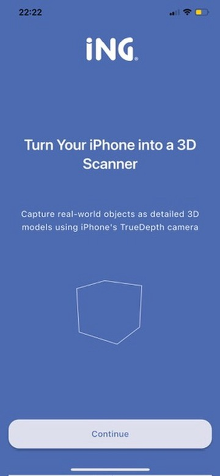
  </div>
  <div style="position: relative; overflow: hidden; border-radius: 8px; box-shadow: 0 2px 8px rgba(0,0,0,0.1); cursor: pointer;" onclick="openModal('assets/2.jpeg')">
    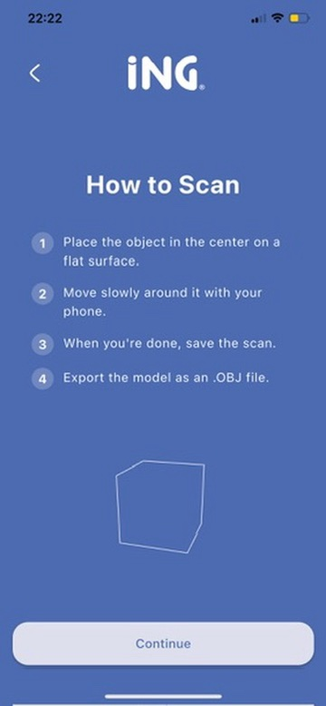
  </div>
  <div style="position: relative; overflow: hidden; border-radius: 8px; box-shadow: 0 2px 8px rgba(0,0,0,0.1); cursor: pointer;" onclick="openModal('assets/3.jpeg')">
    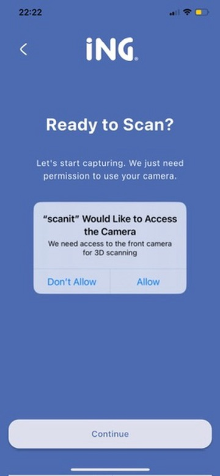
  </div>
  <div style="position: relative; overflow: hidden; border-radius: 8px; box-shadow: 0 2px 8px rgba(0,0,0,0.1); cursor: pointer;" onclick="openModal('assets/4.jpeg')">
    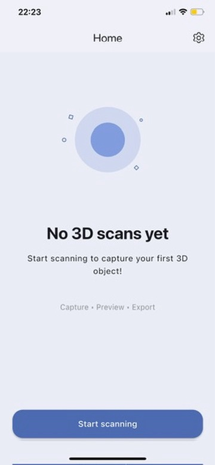
  </div>
  <div style="position: relative; overflow: hidden; border-radius: 8px; box-shadow: 0 2px 8px rgba(0,0,0,0.1); cursor: pointer;" onclick="openModal('assets/5.jpeg')">
    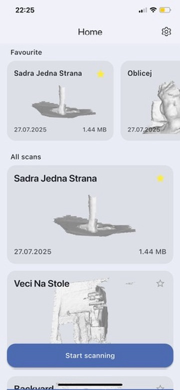
  </div>
  <div style="position: relative; overflow: hidden; border-radius: 8px; box-shadow: 0 2px 8px rgba(0,0,0,0.1); cursor: pointer;" onclick="openModal('assets/6.jpeg')">
    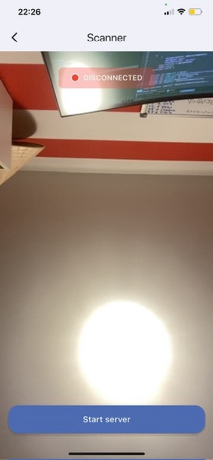
  </div>
  <div style="position: relative; overflow: hidden; border-radius: 8px; box-shadow: 0 2px 8px rgba(0,0,0,0.1); cursor: pointer;" onclick="openModal('assets/7.jpeg')">
    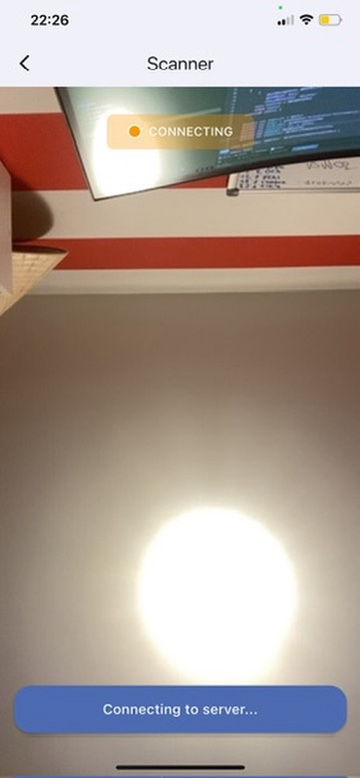
  </div>
  <div style="position: relative; overflow: hidden; border-radius: 8px; box-shadow: 0 2px 8px rgba(0,0,0,0.1); cursor: pointer;" onclick="openModal('assets/8.jpeg')">
    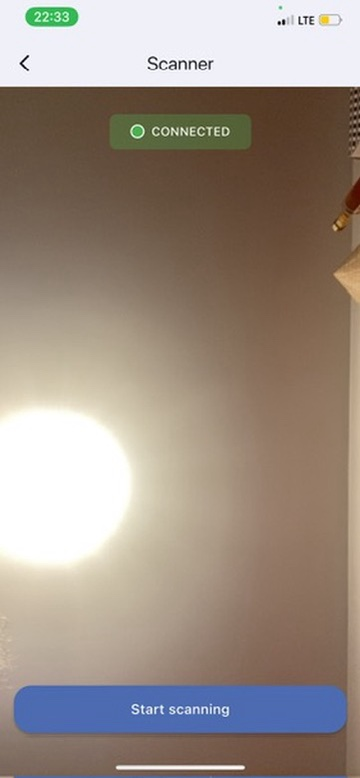
  </div>
  <div style="position: relative; overflow: hidden; border-radius: 8px; box-shadow: 0 2px 8px rgba(0,0,0,0.1); cursor: pointer;" onclick="openModal('assets/9.jpeg')">
    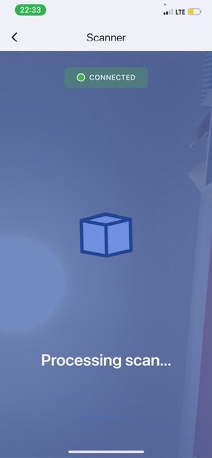
  </div>
  <div style="position: relative; overflow: hidden; border-radius: 8px; box-shadow: 0 2px 8px rgba(0,0,0,0.1); cursor: pointer;" onclick="openModal('assets/10.jpeg')">
    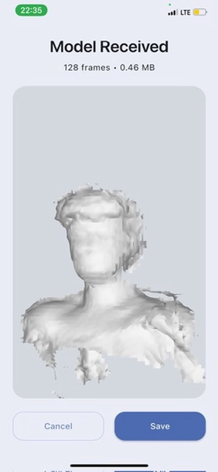
  </div>
  <div style="position: relative; overflow: hidden; border-radius: 8px; box-shadow: 0 2px 8px rgba(0,0,0,0.1); cursor: pointer;" onclick="openModal('assets/11.jpeg')">
    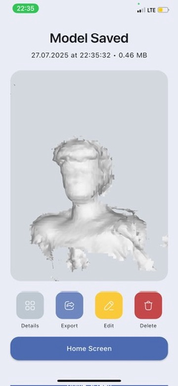
  </div>
  <div style="position: relative; overflow: hidden; border-radius: 8px; box-shadow: 0 2px 8px rgba(0,0,0,0.1); cursor: pointer;" onclick="openModal('assets/12.jpeg')">
    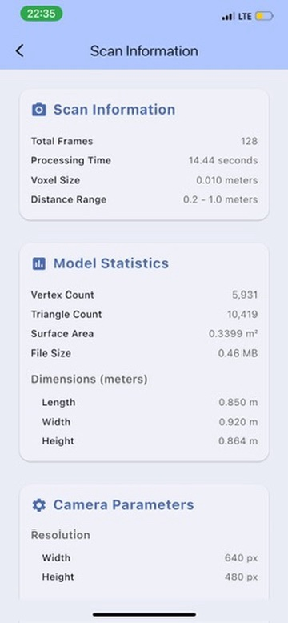
  </div>
  <div style="position: relative; overflow: hidden; border-radius: 8px; box-shadow: 0 2px 8px rgba(0,0,0,0.1); cursor: pointer;" onclick="openModal('assets/13.png')">
    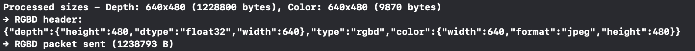
  </div>
  <div style="position: relative; overflow: hidden; border-radius: 8px; box-shadow: 0 2px 8px rgba(0,0,0,0.1); cursor: pointer;" onclick="openModal('assets/14.png')">
    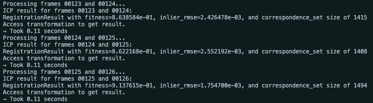
  </div>
  <div style="position: relative; overflow: hidden; border-radius: 8px; box-shadow: 0 2px 8px rgba(0,0,0,0.1); cursor: pointer;" onclick="openModal('assets/15.png')">
    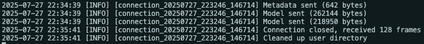
  </div>
  <div style="position: relative; overflow: hidden; border-radius: 8px; box-shadow: 0 2px 8px rgba(0,0,0,0.1); cursor: pointer;" onclick="openModal('assets/16.png')">
    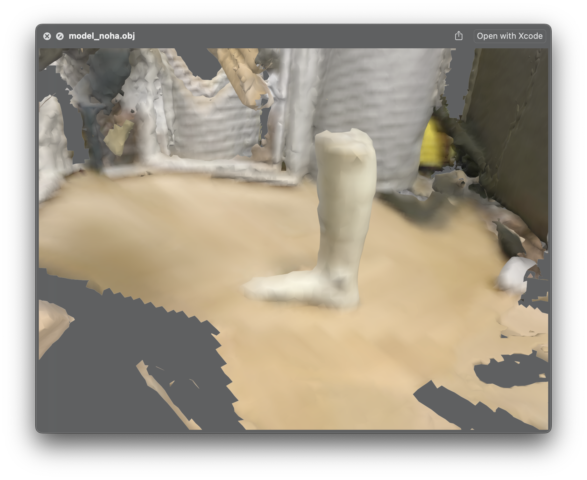
  </div>
</div>

<!-- Modal for enlarged images -->
<div id="imageModal" style="display: none; position: fixed; z-index: 1000; left: 0; top: 0; width: 100%; height: 100%; background-color: rgba(0,0,0,0.9);" onclick="closeModal()">
  <span style="position: absolute; top: 15px; right: 35px; color: #f1f1f1; font-size: 40px; font-weight: bold; cursor: pointer;">&times;</span>
  
</div>

<script>
function openModal(imageSrc) {
  document.getElementById('modalImage').src = imageSrc;
  document.getElementById('imageModal').style.display = 'block';
}

function closeModal() {
  document.getElementById('imageModal').style.display = 'none';
}

// Close modal when clicking outside the image
document.getElementById('imageModal').addEventListener('click', function(e) {
  if (e.target === this) {
    closeModal();
  }
});

// Close modal with Escape key
document.addEventListener('keydown', function(e) {
  if (e.key === 'Escape') {
    closeModal();
  }
});
</script>

*Click on any image to view it in full size. Press ESC or click outside to close.*

---

## 📱 Tech Stack

### Frontend
- **Flutter** for cross-platform UI
- **Swift** for native iOS integrations (camera, WebSocket, depth data access)

### Backend
- **Python WebSocket Server** to handle image and depth data
- Custom processing pipeline (not open sourced)

---

## 📂 Flutter Folder Structure (Showcase)
```
lib/
├── src/
│   ├── core/
│   │   ├── common/              # Shared widgets & components
│   │   ├── error/               # Error handling
│   │   ├── extensions/          # Extension methods
│   │   ├── resources/           # Assets, strings, colors
│   │   ├── routing/             # GoRouter setup
│   │   ├── theme/               # App theming
│   │   └── utils/               # Helper methods
│   ├── features/                # Feature-based structure
│   │   └── [feature]/           # Name of desired feature
│   │       ├── service/         # Handles external services (APIs, Firebase, storage, etc.)
│   │       ├── data/            # Implements repositories, maps data between DTOs and domain models
│   │       ├── domain/          # Contains core business logic: entities, use cases, and repository contracts
│   │       └── presentation/    # UI layer: screens, widgets, controllers and state management
│   └── app.dart                 # App widget
└── main.dart                    # Entry point
```

---

## 🔒 Confidentiality Notice

All parts of the project are proprietary to the company that commissioned this work and **are not included** in this repository.

For academic or technical inquiries, please reach out to the author.

---

## 📧 Author

**Michal Ručka**  
Bachelor's Thesis – VŠB-TUO, Faculty of Electrical Engineering and Computer Science  
Email: ruc0066@vsb.cz